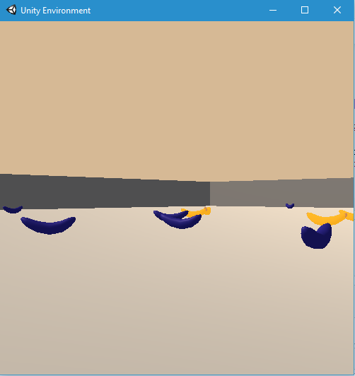

# unity-ml-banana
This repository contains an implementation of reinforcement learning based on Deep-Q-Network (DQN), Double DQN, Dueling DQN, and Priority Experience Replay.<br/>
The target of the agent is to collect good bananas in a square world which is similar to the [banana collector of Unity](https://github.com/Unity-Technologies/ml-agents/blob/master/docs/Learning-Environment-Examples.md#banana-collector).<br/>
For each yellow banana that is collected, the agent is given a reward of +1. The blue ones give -1 reward.<br/>
<br/>
The agent has 4 actions:
* move forward
* move backward
* turn left
* and turn right
`The environment is considered as solved if the agent is winning an average of +13 points for 100 consecutive episodes.`<br/>
A video of a trained agent can be found by clicking on the image here below <br/>
[](https://www.youtube.com/watch?v=Ig4i73Y92EQ)
## Content of this repository
* report.pdf: a document that describes the details of the different implementation, along with ideas for future work
* jupyter notebook load_run_agent.ipynb: a notebook that can load and run the saved agents
* folder __double_dqn__: implementation of double deep q network (succeeded)
* folder __dueling_double_dqn__: implementation of double deep q network with a dueling network (succeeded)
* folder __per_dueling_double_dqn__: implementation of an agent with double DQN, dueling Network, and Prioritized Experience Replay all together (pending)
## Requirements
To run the codes, follow the next steps:
* Create a new environment:
	* __Linux__ or __Mac__: 
	```bash
	conda create --name dqn python=3.6
	source activate dqn
	```
	* __Windows__: 
	```bash
	conda create --name dqn python=3.6 
	activate dqn
	```
* Perform a minimal install of OpenAI gym
	* If using __Windows__, 
		* download swig for windows and add it the PATH of windows
		* install Microsoft Visual C++ Build Tools
	* then run these commands
	```bash
	pip install gym
	pip install gym[classic_control]
	pip install gym[box2d]
	```
* Install the dependencies under the folder python/
```bash
	cd python
	pip install .
```
* Create an IPython kernel for the `dqn` environment
```bash
	python -m ipykernel install --user --name dqn --display-name "dqn"
```
* Download the Unity Environment (thanks to Udacity) which matches your operating system
	* [Linux](https://s3-us-west-1.amazonaws.com/udacity-drlnd/P1/Banana/Banana_Linux.zip)
	* [Mac OSX](https://s3-us-west-1.amazonaws.com/udacity-drlnd/P1/Banana/Banana.app.zip)
	* [Windows (32-bits)](https://s3-us-west-1.amazonaws.com/udacity-drlnd/P1/Banana/Banana_Windows_x86.zip)
	* [Windows (64 bits)](https://s3-us-west-1.amazonaws.com/udacity-drlnd/P1/Banana/Banana_Windows_x86_64.zip)

* Start jupyter notebook from the root of this python codes
```bash
jupyter notebook
```
* Once started, change the kernel through the menu `Kernel`>`Change kernel`>`dqn`
* If necessary, inside the ipynb files, change the path to the unity environment appropriately

